# Project 08: AI Hiring Screener (Deep Agent System)

## 1) System Overview

This project is an **AI hiring operating system** with two product surfaces:
- **Recruiter Panel**: post jobs, upload/manage CVs, receive ranked shortlist with explainable reasoning, interview questions, bias alerts, and mismatch analysis.
- **Candidate Panel**: view openings, upload CV, run a **probability-of-fit simulation** (match/mismatch) before applying.

### Pipeline vs Agent-Based System
- **Normal pipeline**: fixed one-pass sequence (`parse -> score -> rank`), limited adaptation.
- **Agent-based system**: multiple specialized agents reason, debate, trigger re-evaluation, and adapt scoring rules to context.
- **Deep-agent system**: adds multi-step reasoning, conflict resolution, uncertainty handling, and feedback loops (not just single-shot outputs).

## 2) Where Agents Are Used (and Why)

### A. JD Intelligence Layer
- **JD Parser Agent** converts free-text JD into weighted rubric, must-have/nice-to-have skills, seniority signals, and role constraints.
- Why agent: JDs are inconsistent and ambiguous; an agent can infer hidden expectations and normalize language.

### B. Candidate Understanding Layer
- **CV Scoring Agent (parallel per candidate)** maps CV evidence to rubric and produces evidence-backed scores.
- Why agent: each CV needs independent, context-aware reasoning with citations.

### C. Risk & Fairness Layer
- **Bias Detection Agent** identifies biased scoring cues and sensitive proxy signals.
- **Skill Gap Agent** identifies hard skill gaps, trainable gaps, and critical gaps.
- Why agents: fairness and gap severity need nuanced judgment, not simple keyword matching.

### D. Adaptive Decision Layer
- **Adaptive Scoring Agent** updates candidate score based on confidence, ambiguity, and domain-specific context.
- **Debate Agents (Supporter + Critic)** challenge and defend shortlist decisions.
- **Decision Agent** synthesizes all evidence into final class (`strong_fit`, `borderline`, `reject`, `fast_track`).
- Why agents: hiring is uncertain and adversarial; debate improves robustness and explainability.

### E. Interview Planning Layer
- **Interview Question Agent** generates personalized technical + behavioral questions from candidate-specific evidence and gaps.
- Why agent: each interview should target role-critical uncertainty.

## 3) Where Deep Agents Are Required

Use deep agents where one-pass generation is unreliable:

- **Decision-making under ambiguity**: e.g., strong experience but missing one core tool.
- **Reasoning with conflicting evidence**: e.g., title says "Lead" but project depth is junior.
- **Feedback loops**: if bias detected or confidence low, trigger re-score with constraints.
- **Adaptive behavior**: adjust weighting by role (startup generalist vs enterprise specialist).

### Deep Agent Triggers
- `confidence < threshold`
- `bias_risk > threshold`
- `supporter_critic_disagreement == high`
- `critical_skill_missing == true`

When triggered, the deep-agent loop performs:
1. rubric clarification,
2. evidence re-fetch from RAG,
3. constrained re-scoring,
4. final arbitration.

## 4) Agent Design (Implementation-Ready)

## JD Parser Agent
- **Purpose**: convert JD into machine-usable rubric.
- **Input**: JD text, company context, role level.
- **Output**: weighted rubric JSON (`skills`, `experience`, `domain`, `soft_signals`, `must_have`).
- **Tools**: LangChain prompt chain, structured output parser, glossary retriever.
- **Why needed**: normalizes noisy JDs and creates scoring ground truth.
- **Type**: **simple agent** (with retry + schema guardrails).

## CV Scoring Agent (Parallel)
- **Purpose**: score each candidate against rubric with evidence spans.
- **Input**: CV text/chunks, rubric JSON, retrieved evidence.
- **Output**: `score_0_100`, `evidence`, `reasoning_summary`, `confidence`.
- **Tools**: RAG retriever, LLM scorer chain, citation validator.
- **Why needed**: scalable, consistent first-pass evaluation.
- **Type**: **simple agent** (parallelizable, deterministic envelope).

## Bias Detection Agent
- **Purpose**: detect bias proxies and fairness risks.
- **Input**: score rationale, candidate metadata abstraction, decision logs.
- **Output**: `bias_flags`, `risk_level`, `mitigation_actions`.
- **Tools**: fairness rule set + LLM checker + policy prompts.
- **Why needed**: reduces proxy bias and improves compliance.
- **Type**: **deep agent** (triggers re-evaluation loop).

## Skill Gap Agent
- **Purpose**: classify missing skills as critical/trainable/non-critical.
- **Input**: rubric must-haves, CV evidence, role urgency.
- **Output**: `gap_matrix`, `upskill_time_estimate`, `impact_score`.
- **Tools**: taxonomy retriever, reasoning chain.
- **Why needed**: avoids over-rejecting trainable candidates.
- **Type**: **deep agent**.

## Adaptive Scoring Agent
- **Purpose**: recalibrate score using context and uncertainty.
- **Input**: raw score, bias flags, gap matrix, confidence.
- **Output**: `adjusted_score`, `adjustment_reasons`.
- **Tools**: scoring policy engine + LLM reasoner.
- **Why needed**: static scoring fails in real hiring conditions.
- **Type**: **deep agent**.

## Debate Agents (Supporter + Critic)
- **Purpose**: stress-test candidate decisions.
- **Input**: candidate dossier + adjusted score.
- **Output**: pro/contra arguments, unresolved questions.
- **Tools**: dual-prompt argumentative agents, evidence retriever.
- **Why needed**: catches overconfidence and hidden contradictions.
- **Type**: **deep agents**.

## Decision Agent (Final Classifier)
- **Purpose**: issue final disposition.
- **Input**: all prior outputs + debate summary.
- **Output**: `final_class`, `final_score`, `decision_reason`, `next_step`.
- **Tools**: arbitration prompt + policy constraints.
- **Why needed**: one accountable final decision boundary.
- **Type**: **deep agent**.

## Interview Question Agent
- **Purpose**: produce candidate-specific interview questions.
- **Input**: final decision, skill gaps, evidence timeline.
- **Output**: 5-8 questions with expected signal per question.
- **Tools**: question-generation chain + rubric anchor checks.
- **Why needed**: transforms screening into actionable interviewing.
- **Type**: **simple agent** (context-conditioned).

## 5) Deep Agent Logic (Core)

### Multi-step Reasoning Pattern
1. Generate draft judgment.
2. Validate with evidence/citations.
3. Detect conflicts and bias.
4. Re-retrieve missing evidence.
5. Re-score under constraints.
6. Debate and arbitrate.

### Feedback Loop Rules (Pseudocode)
```python
if raw_score >= 75 and critical_skill_gap >= 1:
    class_label = "borderline"
    trigger = "gap_review"

if bias_risk == "high":
    trigger = "fairness_rerun"
    remove_sensitive_proxies = True

if supporter_confidence - critic_confidence >= 20:
    trigger = "critic_rebuttal_round"

if final_confidence < 0.65:
    class_label = "needs_human_review"
```

```python
while trigger in {"gap_review", "fairness_rerun", "critic_rebuttal_round"} and loops < 2:
    evidence = retriever.fetch(additional_queries)
    adjusted_score = adaptive_scoring(evidence, constraints)
    debate = run_debate(adjusted_score, evidence)
    decision = arbitrate(debate, policy)
    loops += 1
```

## 6) LangGraph Architecture

Node flow:
`START -> JD Parser -> CV Extractor -> Scorer(parallel) -> Bias -> Skill Gap -> Adaptive Scoring -> Debate -> Decision -> Interview -> END`

### State Management
Use typed state object:
- `job_id`, `jd_text`, `rubric`
- `candidate_docs[]`, `candidate_scores[]`
- `bias_report[]`, `skill_gap_report[]`
- `adaptive_scores[]`, `debate_records[]`
- `final_decisions[]`, `interview_questions[]`
- `audit_log`, `confidence_metrics`

### Parallel Execution
- `scorer_node` runs one branch per candidate via `asyncio.gather`.
- Optional per-candidate mini-graph for bias/gap/adaptive before merge.

### Shared Data Strategy
- All node outputs stored in state by `candidate_id`.
- Downstream nodes read immutable snapshots + append audit entries.
- Decision node consumes a consolidated candidate dossier.

```mermaid
flowchart LR
    startNode[START] --> jdParser[JDParserAgent]
    jdParser --> cvExtractor[CVExtractorNode]
    cvExtractor --> scorer[CVScoringAgentParallel]
    scorer --> biasNode[BiasDetectionAgent]
    biasNode --> gapNode[SkillGapAgent]
    gapNode --> adaptiveNode[AdaptiveScoringAgent]
    adaptiveNode --> debateNode[SupporterCriticDebate]
    debateNode --> decisionNode[DecisionAgent]
    decisionNode --> interviewNode[InterviewQuestionAgent]
    interviewNode --> endNode[END]
```



## 7) RAG Strategy: Semantic vs Hybrid (Recommendation)

For this project, **Hybrid RAG is better** than pure semantic retrieval.

### Why Hybrid Wins Here
- CV/JD matching has both:
  - **exact signals** (e.g., `Kubernetes`, `TensorRT`, `3+ years`), and
  - **semantic signals** (e.g., "built distributed pipelines" ~ backend systems experience).
- Pure semantic may miss strict must-have tokens.
- Pure keyword/BM25 misses paraphrased evidence.
- Hybrid retrieval (BM25 + vector + reranker) best balances precision and recall.

### Recommended Retrieval Stack
- **Primary**: Hybrid retriever (`BM25 + dense embeddings`).
- **Reranker**: cross-encoder reranking top-k passages.
- **Chunking**: section-aware CV chunks (`experience`, `projects`, `skills`, `education`).
- **Query strategy**:
  - query expansion from rubric must-haves,
  - synonym expansion (e.g., "LLMOps" ↔ "model deployment").

## 8) Real-World Candidate Walkthroughs

### Example A: Strong but Missing One Core Skill
- Candidate: 6 years backend, strong system design, no production Kubernetes.
- Scorer: high architecture score, low infra-tool match.
- Skill Gap Agent: marks K8s as critical but trainable in 4-6 weeks.
- Debate: Supporter argues transferability; Critic flags immediate project risk.
- Decision: `borderline_shortlist` with targeted K8s interview.

### Example B: Keyword Match but Weak Evidence
- Candidate: claims "expert in GenAI" but projects are shallow.
- Scorer: medium score with low confidence.
- Bias Agent: no fairness risk.
- Adaptive Agent: reduces score for low evidence density.
- Decision: `reject_with_reason` or `needs_assignment`.

### Example C: Non-traditional Background, High Potential
- Candidate: career switcher, strong portfolio, no CS degree.
- Scorer: moderate score.
- Bias Agent: flags degree-proxy bias risk.
- Re-evaluation: remove education overweighting, boost project evidence.
- Decision: `shortlist` with structured technical screen.

## 9) Why This Beats a Normal Pipeline

- **Higher intelligence**: decisions are challenged and validated by debate + arbitration.
- **Adaptive behavior**: scoring changes with uncertainty, role type, and fairness constraints.
- **Hiring realism**: mirrors actual panel dynamics (support, critique, final committee decision).
- **Trust and explainability**: evidence-linked outputs, confidence, and audit trail.

## 10) Recruiter + Candidate Product Design

## Recruiter Panel
- Create/post jobs with rubric preview and editable weights.
- Upload CV batch and view ranked shortlist.
- Inspect per-candidate evidence, bias flags, gap map, and debate transcript.
- Export shortlist and interview kit.

## Candidate Panel
- Browse active openings.
- Upload CV for **fit probability simulation**.
- Receive `match_score`, `mismatch_reasons`, `improvement_plan`, and role-wise suggestions.
- Optional: "what-if" mode after uploading an updated CV.

## 11) Junior AI Engineer Portfolio Alignment (Industry-Ready)

This project demonstrates the exact capabilities companies look for in junior AI engineers:
- LangChain + LangGraph orchestration in a multi-agent production flow.
- RAG design (hybrid retrieval, reranking, citations).
- Reliable structured outputs with validation and retries.
- Responsible AI controls (bias checks, audit logs, human-review gates).
- Full-stack AI product thinking (API, UI, evals, deployment, monitoring).

## 12) Implementation Roadmap (4 Weeks)

### Week 1: Core Foundations
- Repo scaffold, data contracts, auth, recruiter/candidate role models.
- CV/JD parsing, chunking, vector + BM25 indexing.

### Week 2: Agent Graph V1
- JD Parser, CV Scoring (parallel), Skill Gap, Interview Question agents.
- Recruiter shortlist UI v1.

### Week 3: Deep Agent Intelligence
- Bias Detection, Adaptive Scoring, Debate agents, Decision arbitration.
- Feedback loops + re-evaluation logic.

### Week 4: Product Hardening
- Candidate probability simulator, exports, observability, eval suite.
- Demo scenarios, latency tuning, deployment.

## 13) Suggested Technical Stack
- **Backend**: FastAPI, LangChain, LangGraph, Pydantic, asyncio.
- **RAG**: Chroma/PGVector + BM25 retriever + reranker.
- **LLM**: GPT-4o class model for reasoning and structured outputs.
- **Parsing**: PyMuPDF for CV PDFs.
- **Frontend**: React (Vite) dashboards.
- **Ops**: Docker, Redis queue (optional), LangSmith tracing, pytest evals.

## 14) Interview Explanation (3-4 Lines)

"I built a deep-agent hiring screener using LangGraph, where specialized agents parse JDs, score CVs in parallel, detect bias, identify skill gaps, and run supporter-vs-critic debates before final decisions. Instead of a one-pass pipeline, the system uses feedback loops and adaptive rescoring when confidence is low or fairness risks appear. I implemented hybrid RAG with reranking to combine exact skill matching and semantic evidence retrieval. The result is a recruiter-grade shortlist with transparent reasoning, interview questions, and candidate fit simulation."

## 15) Missing Industry-Critical Skills Added (Now Included)

To maximize junior AI engineer job readiness, these critical areas are now explicitly part of implementation:

- **Evaluation Engineering (must-have)**
  - Offline golden dataset (JDs + CVs + expected shortlist labels).
  - Metrics: Precision@K shortlist quality, ranking NDCG, citation faithfulness, bias parity checks.
  - Regression suite for every prompt/model update.

- **Reliability Engineering for AI Systems**
  - Retries with exponential backoff, strict timeouts, circuit breakers.
  - Fallback path when LLM fails (rule-based scoring baseline + human-review queue).
  - Idempotent job processing for batch CV uploads.

- **Observability and Debuggability**
  - LangSmith traces per candidate and per agent node.
  - Structured logs (`job_id`, `candidate_id`, `node`, `latency_ms`, `token_cost`).
  - Alerting on latency spikes, parser failures, and confidence drops.

- **Security, Privacy, and Compliance**
  - PII handling: redaction in logs, encrypted storage for CVs, signed URL upload flow.
  - RBAC for recruiter/candidate/admin roles.
  - Data retention and delete-by-request workflow.

- **MLOps/LLMOps Delivery Standard**
  - Prompt/version registry and changelog.
  - CI/CD with tests, lint, typing, and eval gate before deploy.
  - Environment-based config and secret management.

- **Cost and Performance Engineering**
  - Token budget policy per stage, caching of JD rubric + CV embeddings.
  - Dynamic model routing (small model first, escalate to stronger model on low confidence).
  - Async worker queue for high-volume hiring batches.

## 16) Industry-Ready Acceptance Criteria (Hiring-Focused)

Project is considered complete only if these are achieved:
- End-to-end processing for 100 CVs in target SLA with traceable agent logs.
- Every final decision includes evidence citations and confidence score.
- Bias detection and re-evaluation trigger works on test scenarios.
- Candidate panel provides actionable mismatch/improvement feedback.
- CI pipeline blocks merges on failing tests/evals.
- Demo includes recruiter workflow + candidate self-check workflow.

## 17) Resume and Portfolio Outcomes (Junior AI Engineer)

This upgraded scope helps you present real industry signals:
- Built production-grade multi-agent system with LangGraph and hybrid RAG.
- Implemented reliability, evaluation, observability, and AI safety controls.
- Delivered full product workflow (recruiter panel + candidate fit simulation).
- Measured and optimized quality, latency, and cost with deployment-ready practices.

## 18) Mandatory Junior AI Engineer Skills (Industry) and How This Project Covers Them

This section is the direct hiring-focused checklist: what companies expect and where you learn it in this project.

### A) Python Backend Engineering (Mandatory)
- **Industry need**: clean APIs, async processing, error handling, schema validation.
- **In this project**: FastAPI services, async candidate processing, Pydantic contracts, retry/timeout logic.
- **Interview proof**:
  - Explain one API endpoint from request to response validation.
  - Explain how you prevent duplicate processing (idempotency).

### B) LLM App Fundamentals (Mandatory)
- **Industry need**: prompt design, structured outputs, model failure handling.
- **In this project**: JSON schema-constrained outputs for rubric/scoring/decision nodes.
- **Interview proof**:
  - Show malformed output recovery strategy.
  - Explain prompt versioning and why deterministic contracts matter.

### C) RAG System Design (Mandatory)
- **Industry need**: retrieval quality, grounding, citation-based reasoning.
- **In this project**: hybrid retrieval (BM25 + vectors + reranker), section-aware chunking, evidence citations.
- **Interview proof**:
  - Justify why hybrid beats pure semantic for CV/JD matching.
  - Explain precision/recall tradeoff with examples.

### D) Agent Orchestration (High-Value and Differentiating)
- **Industry need**: multi-step reasoning and workflow control.
- **In this project**: LangGraph state machine with deep agents and feedback loops.
- **Interview proof**:
  - Walk through one candidate through scorer -> bias -> debate -> decision.
  - Explain when and why re-evaluation is triggered.

### E) Evaluation and Testing (Mandatory in good teams)
- **Industry need**: prove quality, avoid regressions, ship safely.
- **In this project**: golden dataset, ranking metrics, citation faithfulness checks, regression eval pipeline.
- **Interview proof**:
  - Discuss one failed eval and what change fixed it.
  - Explain offline eval vs online monitoring.

### F) Reliability and Production Readiness (Mandatory)
- **Industry need**: systems that fail safely under load.
- **In this project**: fallbacks, circuit-breakers, worker queues, failure-safe human review paths.
- **Interview proof**:
  - Explain one real failure mode and fallback path.
  - Explain your SLA target and how it is measured.

### G) Observability and Cost Awareness (Mandatory in startups)
- **Industry need**: tracing, latency tracking, token/cost control.
- **In this project**: LangSmith traces, structured logs, cost-per-candidate dashboard.
- **Interview proof**:
  - Show one tracing screenshot and debugging story.
  - Explain cost optimization (cache + model routing).

### H) Security and Privacy (Mandatory when handling resumes)
- **Industry need**: PII safety, access control, auditability.
- **In this project**: RBAC, encrypted resume storage, redacted logs, retention/deletion controls.
- **Interview proof**:
  - Explain how candidate data is protected end-to-end.
  - Explain recruiter role access boundaries.

### I) CI/CD and Team Engineering Practices (Mandatory)
- **Industry need**: shipping through quality gates in teams.
- **In this project**: lint/type/test/eval checks in CI; reproducible local setup.
- **Interview proof**:
  - Explain merge gate policy and release confidence.
  - Show one pipeline run and blocked merge example.

## 19) Learning Plan to Clear Junior AI Engineer Interviews

Use this exact order while implementing:

1. **Backend + Schema First**
   Build FastAPI + Pydantic contracts + async processing basics.
2. **RAG Foundation**
   Implement chunking, indexing, hybrid retrieval, reranking, citation extraction.
3. **Agent Graph Core**
   Build LangGraph nodes for parser/scorer/decision with typed state.
4. **Deep Agent Layer**
   Add bias, adaptive scoring, debate, and arbitration loops.
5. **Evaluation Harness**
   Create test data + metrics + regression pipeline.
6. **Prod Hardening**
   Add reliability controls, observability, and cost optimization.
7. **Security + CI/CD**
   Add RBAC, PII handling, retention rules, and CI quality gates.

## 20) Mandatory Deliverables Before You Put It on Resume

Only add to resume after these are complete:
- Public demo link working end-to-end.
- Architecture diagram (LangGraph + RAG + deep-agent loops).
- Eval report with metrics (ranking quality + faithfulness + bias checks).
- Trace screenshots and one debugging case study.
- CI passing badge and deployment guide.
- Recruiter panel + candidate fit simulator both demonstrated.

## 21) Interview Drill Questions You Must Be Able to Answer

- Why did you choose hybrid RAG over semantic-only retrieval?
- How does your system prevent hallucinated scoring claims?
- What triggers deep-agent re-evaluation loops?
- How do you measure model quality and detect regressions?
- What is your fallback when the LLM output is invalid or times out?
- How do you secure resume PII and audit access?
