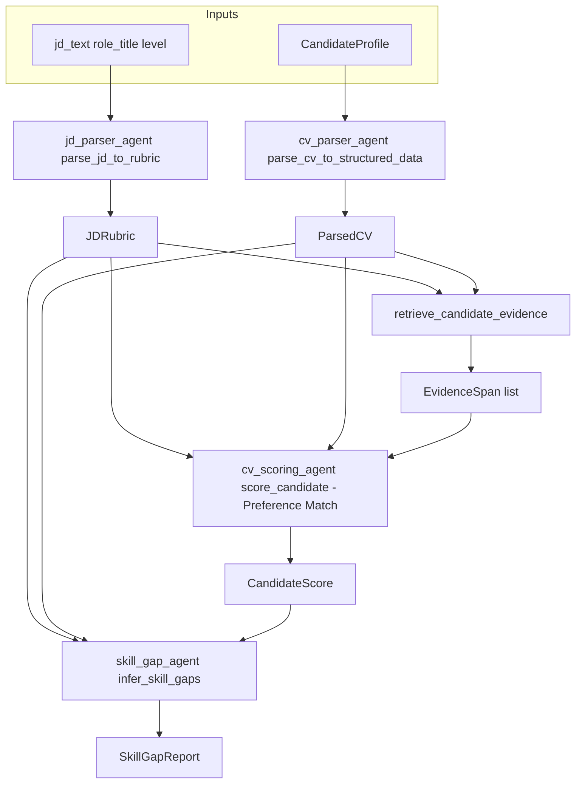

# Stage 1 — Detailed Working Plan: JD Parser, CV Scorer, Skill Gap Analyzer

> **Companion to:** [development_flow.md](../development_flow.md) (Stage 1, Steps 1.1–1.3)  
> **Scope:** Only these three agents plus their prerequisites (LLM client, prompts, wiring). Does not cover LangGraph, other agents, or RAG upgrades.

---

## 1. Purpose

Turn three placeholder implementations into **real LLM-backed agents** that return **validated Pydantic models**:

| Agent | Module | Function | Output model |
|-------|--------|----------|--------------|
| JD Parser | `backend/app/agents/jd_parser_agent.py` | `parse_jd_to_rubric(jd_text, role_title, level)` | `JDRubric` |
| CV Parser | `backend/app/agents/cv_parser_agent.py` | `parse_cv_to_structured_data(cv_text)` | `ParsedCV` |
| CV Scorer | `backend/app/agents/cv_scoring_agent.py` | `score_candidate(candidate, rubric)` | `CandidateScore` |
| Skill Gap | `backend/app/agents/skill_gap_agent.py` | `infer_skill_gaps(...)` | `SkillGapReport` |

**Schemas:** `backend/app/models/schemas.py` (`JDRubric`, `SkillRequirement`, `CandidateProfile`, `CandidateScore`, `EvidenceSpan`, `SkillGapReport`, `SkillGapItem`).

---

## 2. Dependency order (do not skip)

Work strictly in this sequence; later steps assume earlier ones exist.

```
Step A ──▶ Step B ──▶ Step C ──▶ Step D
```

| Step | What | Files |
|------|------|--------|
| **A** | Central LLM client (structured JSON → Pydantic, retries, timeout, logging) | `backend/app/core/llm.py`, `backend/app/core/config.py`, `.env` / `.env.example` |
| **B** | Prompt registry for the three prompts | `backend/app/prompts/jd_parser.py`, `cv_scorer.py`, `skill_gap_analyzer.py` |
| **C** | Agent implementations calling the client + prompts | `jd_parser_agent.py`, `cv_scoring_agent.py`, `skill_gap_agent.py` |
| **D** | Manual verification (CLI snippets or small script) | ad hoc `python -c` or `tests/` (optional) |

**Rule:** No agent code should call raw HTTP/SDK except inside `LLMClient`.

---

## 3. End-to-end data flow



**Pipeline order for a full screen:** parse JD → (for each candidate) score CV → infer skill gaps. The skill gap step should consume the **same** `JDRubric` and ideally the **`CandidateScore`** from the scorer so gaps align with stated strengths/weaknesses.

---

## 4. Prerequisite Step A — LLM client

### 4.1 Configuration (`core/config.py`)

Add (names can match your `.env`; document in `.env.example`):

- API key: `OPENAI_API_KEY` and/or `OPENROUTER_API_KEY` (choose one primary path).
- `LLM_BASE_URL` (e.g. OpenAI default or `https://openrouter.ai/api/v1`).
- `LLM_MODEL` (e.g. `gpt-4o-mini` for dev).
- `LLM_TIMEOUT_SECONDS` (e.g. 30).
- `LLM_MAX_RETRIES` (e.g. 3) with exponential backoff (1s → 2s → 4s cap).

### 4.2 Client API (`core/llm.py`)

Minimum surface for agents:

- `async def generate_structured(self, *, system_prompt: str, user_prompt: str, output_schema: type[BaseModel]) -> BaseModel`
  - Use chat completions with **JSON mode** or **response_format** that forces JSON.
  - Parse JSON and validate with `output_schema.model_validate(...)`.
  - Retries on parse errors and transient API errors; log model, latency, token usage if available.
- Optional: `ModelFailure` or sentinel + exception type so agents can branch to fallbacks.

**Sync agents:** If `score_candidate` stays synchronous, either use `asyncio.run()` for a single call (acceptable for scripts) or provide a thin sync wrapper `generate_structured_sync` that runs the async method. Prefer one consistent pattern across the three agents.

### 4.3 Verification (Step A)

- One-off script: call `generate_structured` with a trivial schema (e.g. `{ "answer": str }`) and confirm a valid object returns.

---

## 5. Step B — Prompt registry (three files)

Each prompt file should export at least:

- `SYSTEM_PROMPT: str`
- `USER_PROMPT_TEMPLATE: str` with explicit placeholders
- `OUTPUT_SCHEMA` or documented reference to the Pydantic model used for validation

Optional: `build_user_prompt(**kwargs) -> str` to centralize formatting.

### 5.1 `prompts/jd_parser.py` → `JDRubric`

**Goal:** Convert unstructured JD text into a structured rubric of recruiter preferences.

**Template variables:** `jd_text`, `role_title`, `level`.

---

### 5.2 `prompts/cv_parser.py` → `ParsedCV`

**Goal:** Extract full structured profile from candidate's raw CV text.

**Template variables:** `cv_text`.

**Prompt techniques:**
- Comprehensive extraction: Education history, Professional experience with bullet points, Tech stack, and Contact details.
- Output format: Strictly formatted JSON/YAML matching the `ParsedCV` schema.

---

### 5.3 `prompts/cv_scorer.py` → `CandidateScore`

**Goal:** Perform "Preference Matching" by scoring the candidate against the rubric.
- Instruct: must-have vs nice-to-have, realistic `SkillRequirement.weight` in `[0, 1]`, `mandatory` flags, `experience_years_min`, `behavioral_signals`, optional `education_preferences`, keep `weighting` defaults or set explicitly if the model can fill them consistently.

**Post-processing (in agent or helper):**

- If LLM omits `weighting`, rely on schema defaults.
- Optionally **normalize** weights within must-have and nice-to-have groups so they sum to sensible totals (document the rule, e.g. sum to 1.0 per group or leave as-is if product accepts raw weights).

### 5.2 `prompts/cv_scorer.py` → `CandidateScore`

**Goal:** Score the candidate against the rubric with explicit reasoning and evidence.

**Template variables:** `rubric_json` (compact JSON string of `JDRubric`), `cv_text`, `evidence_chunks` (formatted list of retrieved chunks: chunk id, text snippet, relevance).

**Prompt techniques:**

- Chain-of-thought: ask the model to reason step-by-step **then** emit JSON matching the schema (or use a two-field structure if you split CoT from final JSON in one response — single JSON output is simpler for parsing).
- Require `evidence` entries to **quote or paraphrase** only from provided chunks/CV text; `source_chunk_id` must match an id from `evidence_chunks` when using retrieval.

**Field mapping:**

- `candidate_id`: set in code from `CandidateProfile.candidate_id`, not from the model (avoids hallucinated ids).
- `raw_score` ∈ [0, 100], `confidence` ∈ [0, 1] — clamp in code if needed.
- `strengths` / `weaknesses`: lists of short strings.
- `evidence`: list of `EvidenceSpan` (`source_chunk_id`, `quote`, `relevance_score`).
- `reasoning_summary`: one coherent paragraph.

### 5.3 `prompts/skill_gap_analyzer.py` → `SkillGapReport`

**Goal:** List skill gaps with severity and upskill estimate, not only keyword absence.

**Template variables:** `rubric_json`, `cv_text`, optional `score_json` or `reasoning_summary` + bullet lists from `CandidateScore` so gaps align with the scorer.

**Prompt techniques:**

- For each relevant rubric skill (especially must-have), classify:
  - **present / partial / missing**
  - `gap_type`: `critical` | `trainable` | `non_critical`
  - `estimated_upskill_weeks`: integer or null if not applicable
- `impact_score` ∈ [0, 1]: either produced by the model or **computed in code** from gap count/severity (recommended: compute in code for stability).

**Recommended signature change (agent):**

```text
infer_skill_gaps(
    candidate: CandidateProfile,
    rubric: JDRubric,
    score: CandidateScore | None = None,
) -> SkillGapReport
```

When `score` is provided, include `strengths`, `weaknesses`, and `reasoning_summary` in the user prompt.

### 5.4 Verification (Step B)

- Print filled prompts with dummy data; read for clarity and missing variables.

---

## 6. Step C — Agent implementation

### 6.0 CV Parser Agent (`cv_parser_agent.py`)

**Goal:** Extract structured data to be used as source of truth for all matching logic.

1. Build prompts from `prompts/cv_parser.py`.
2. Call `LLMClient.generate_structured(..., output_schema=ParsedCV)`.
3. Handle: Missing fields or poor text extraction from PDF.

### 6.1 JD Parser Agent (`jd_parser_agent.py`)

**Current behavior:** Hardcoded skills + `"fastapi" in jd_text`.

**Target behavior:**

1. Build `system_prompt` + `user_prompt` from `prompts/jd_parser.py`.
2. Call `LLMClient.generate_structured(..., output_schema=JDRubric)`.
3. Overwrite `role_title` / `level` from function arguments if the product should treat caller intent as source of truth (document this choice).
4. **Fallback:** If LLM fails after retries, return a **minimal** `JDRubric` (e.g. 2–3 must-haves inferred from simple keyword extraction or a single generic “Role-specific technical skills” line) so the pipeline never crashes.

### 6.2 CV Scoring Agent (`cv_scoring_agent.py`)

**Current behavior:** Substring hit ratio + `retrieve_candidate_evidence`.

**Target behavior:**

1. Build query string from rubric skill names (same idea as today) and call `retrieve_candidate_evidence(candidate_id, cv_text, query)`.
2. Format evidence for the prompt.
3. Call LLM with `CandidateScore` schema; **inject** `candidate_id` from `candidate` after validation.
4. Merge/dedupe: if the model returns evidence spans, prefer those that reference valid chunk ids; drop invalid ids or map to nearest chunk with a logged warning.
5. **Fallback:** On failure, optional degraded score using the old heuristic **or** a low-confidence default with explicit `reasoning_summary` explaining model failure.

### 6.3 Skill Gap Agent (`skill_gap_agent.py`)

**Current behavior:** Any must-have skill not substring-matching `cv_text` → `critical` gap.

**Target behavior:**

1. Accept optional `CandidateScore` (recommended).
2. Call LLM with `SkillGapReport` schema; inject `candidate_id` from `candidate`.
3. Compute `impact_score` in code, e.g. weighted by `gap_type` and count, clamped to [0, 1].
4. **Fallback:** Revert to the simple substring heuristic from the current implementation, or return empty gaps with `impact_score=0.0` and a note in logs.

### 6.4 Callers of `infer_skill_gaps`

Search for usages (e.g. `langgraph_flow.py`, `graph_runner.py`) and update call sites to pass `score` when available so the gap analyzer stays consistent with the scorer.

---

## 7. Failure modes and policy

| Failure | JD Parser | CV Scorer | Skill Gap |
|---------|-----------|-----------|-----------|
| Timeout / 5xx | Retry then minimal rubric | Retry then fallback score | Retry then heuristic or empty report |
| Invalid JSON | Retry once with “fix JSON” nudge | Same | Same |
| Validation error (Pydantic) | Retry or fallback rubric | Retry or fallback | Retry or heuristic |
| Empty CV | N/A | Low score + explicit weakness | Few or no gaps, or all critical |

Log: request id / candidate id, model name, latency, success/failure reason (no PII in production logs if policy requires redaction).

---

## 8. Verification checklist (Step D)

Use after implementation.

- [ ] `parse_jd_to_rubric` returns valid `JDRubric` for a 200-word JD sample.
- [ ] `score_candidate` returns valid `CandidateScore` with `candidate_id` matching input.
- [ ] `infer_skill_gaps` returns valid `SkillGapReport`; `impact_score` in range.
- [ ] With API key removed or wrong, each agent hits fallback without crashing.
- [ ] No remaining hardcoded skill lists in these three agents (except documented fallback paths).

**Example invocations** (run from repo root with `PYTHONPATH=backend` or from `backend` with `app` on path — adjust to your project layout):

```bash
cd backend && python -c "
from app.agents.jd_parser_agent import parse_jd_to_rubric
r = parse_jd_to_rubric('We need a Python engineer with FastAPI and PostgreSQL.', 'Backend Engineer', 'mid')
print(r.model_dump_json(indent=2))
"
```

```bash
cd backend && python -c "
from app.agents.cv_scoring_agent import score_candidate
from app.models.schemas import CandidateProfile, JDRubric, SkillRequirement
rubric = JDRubric(role_title='Dev', level='mid', must_have_skills=[SkillRequirement(name='Python', weight=0.5, mandatory=True)])
c = CandidateProfile(candidate_id='c1', name='A', cv_text='5 years Python, FastAPI, Postgres.')
print(score_candidate(c, rubric).model_dump_json(indent=2))
"
```

```bash
cd backend && python -c "
from app.agents.skill_gap_agent import infer_skill_gaps
from app.models.schemas import CandidateProfile, JDRubric, SkillRequirement, CandidateScore
rubric = JDRubric(role_title='Dev', level='mid', must_have_skills=[SkillRequirement(name='Rust', weight=0.5, mandatory=True)])
c = CandidateProfile(candidate_id='c1', name='A', cv_text='Python only.')
s = CandidateScore(candidate_id='c1', raw_score=40.0, confidence=0.5, strengths=[], weaknesses=['No Rust'], evidence=[], reasoning_summary='Weak match.')
print(infer_skill_gaps(c, rubric, s).model_dump_json(indent=2))
"
```

(Adjust `infer_skill_gaps` signature if you implement the optional `score` parameter.)

---

## 9. Out of scope (reminder)

- Bias, adaptive scoring, debate, decision, interview agents.
- Compiling or changing LangGraph (`langgraph_flow.py`) beyond updating `infer_skill_gaps` call signature if needed.
- Replacing hybrid retrieval / reranker with “real” RAG (Stage 3).

---

## 10. Suggested commit milestones

1. `feat(llm): structured LLM client + settings`
2. `feat(prompts): jd_parser, cv_scorer, skill_gap_analyzer`
3. `feat(agents): wire JD parser, CV scorer, skill gap to LLM + fallbacks`

This keeps reviews small and bisect-friendly.
