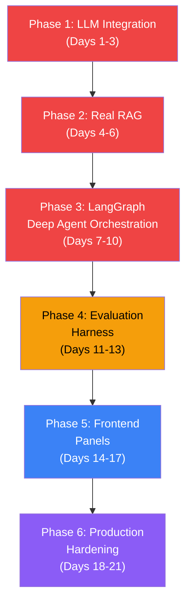

# Project 08: Deep Agents — Full Analysis & Implementation Plan

## Executive Summary

Your plan document is **excellent in design** — it covers agent orchestration, deep-agent reasoning, hybrid RAG, debate loops, evaluation, and production hardening. However, **the current codebase is a structural scaffold with placeholder logic**. No actual LLM calls exist, the RAG system uses token-overlap proxies instead of real embeddings, and LangGraph is imported but not used as a state machine. You're at roughly **~25% completion** toward a junior AI engineer portfolio piece.

This document maps every gap, ranks them by impact, and gives you a concrete phase-by-phase implementation plan.

---

## 1. Current State Audit — What Exists vs What's Needed

### ✅ What You've Built (Good Foundation)

| Component | File(s) | Status |
|-----------|---------|--------|
| FastAPI app with health + screen endpoints | `main.py` | ✅ Working |
| Pydantic data contracts (10+ models) | `models/schemas.py` | ✅ Solid |
| TypedDict LangGraph state shape | `models/state.py` | ✅ Defined |
| Agent function stubs (all 9 agents) | `agents/*.py` | ⚠️ Placeholder logic |
| Section-aware CV chunking | `retrieval/chunking.py` | ✅ Good |
| Hybrid retriever class | `retrieval/hybrid.py` | ⚠️ Proxy scores, no embeddings |
| Reranker class | `retrieval/reranker.py` | ⚠️ Token overlap, no cross-encoder |
| Evidence service pipeline | `services/evidence_service.py` | ✅ Wired but using proxies |
| Graph runner with re-eval loop | `services/graph_runner.py` | ⚠️ Not using LangGraph |
| LangGraph node functions | `services/langgraph_flow.py` | ⚠️ Defined but not compiled into graph |
| LangSmith tracing setup | `utils/tracing.py` | ✅ Working |
| Request logging middleware | `utils/logging.py` | ✅ Working |
| React frontend scaffold | `frontend-react/` | ⚠️ Exists but basic |
| Docs (eval, product scope) | `docs/` | ✅ Good |

### ❌ Critical Gaps (What's Missing)

| # | Gap | Impact | Why It Matters for Junior AI Engineer |
|---|-----|--------|--------------------------------------|
| 1 | **No LLM integration anywhere** | 🔴 Critical | Every agent uses hardcoded logic. No prompt engineering, no structured output parsing, no model calls. This is THE core skill. |
| 2 | **LangGraph not used as a state machine** | 🔴 Critical | `langgraph_flow.py` defines node functions but never compiles them into a `StateGraph`. `graph_runner.py` calls agents sequentially in plain Python. |
| 3 | **RAG is fake** — no vector DB, no embeddings | 🔴 Critical | `hybrid.py` uses token-set overlap as "BM25 proxy" and keyword hits as "vector proxy". No Chroma/FAISS, no embedding model. |
| 4 | **No real deep-agent feedback loops in LangGraph** | 🔴 Critical | The `while should_rerun_evaluation()` loop in `graph_runner.py` is plain Python, not a LangGraph conditional edge with state-driven re-routing. |
| 5 | **Debate agents are template strings, not LLM reasoning** | 🟡 High | Supporter/Critic just format f-strings. No adversarial prompting, no multi-turn argumentation. |
| 6 | **No evaluation harness** | 🟡 High | `tests/evals/` is empty. No golden dataset, no ranking metrics, no citation faithfulness checks. |
| 7 | **Frontend is minimal** | 🟡 High | Single `App.jsx` with basic form. No recruiter dashboard, no candidate panel, no visualization of agent reasoning. |
| 8 | **JD Parser is hardcoded** | 🟡 High | Always returns the same rubric regardless of JD input. |
| 9 | **No PDF upload/parsing** | 🟡 Medium | PyMuPDF listed as dependency but no CV file upload endpoint. |
| 10 | **No RBAC / auth** | 🟡 Medium | No recruiter vs candidate role separation. |
| 11 | **No CI/CD pipeline** | 🟡 Medium | No GitHub Actions, no lint/type/test gates. |
| 12 | **No prompt versioning / registry** | 🟡 Medium | Prompts will be inline strings — no version control or A/B testing. |

---

## 2. Junior AI Engineer Readiness Scorecard

| Skill Area | Plan Covers It? | Current Code? | Gap to Close |
|------------|:-:|:-:|---|
| **LLM App Fundamentals** (prompts, structured output, error handling) | ✅ | ❌ | Wire LLM calls with JSON schema output, retry logic, fallback |
| **RAG System Design** (hybrid retrieval, reranking, citations) | ✅ | ⚠️ Scaffold only | Real embeddings, vector store, BM25, cross-encoder reranker |
| **Agent Orchestration** (LangGraph, multi-agent, state machines) | ✅ | ❌ | Build actual `StateGraph`, conditional edges, parallel branches |
| **Deep Agent Reasoning** (feedback loops, conflict resolution) | ✅ | ⚠️ Basic while-loop | LangGraph conditional routing, evidence re-fetch, constrained re-scoring |
| **Evaluation Engineering** (golden datasets, metrics, regression) | ✅ | ❌ | Build eval suite with Precision@K, NDCG, citation faithfulness |
| **Python Backend** (FastAPI, async, validation) | ✅ | ✅ Good | Minor: add file upload, auth, idempotency |
| **Reliability** (retries, timeouts, fallbacks) | ✅ | ❌ | Add exponential backoff, circuit breakers, rule-based fallback |
| **Observability** (tracing, structured logs, cost tracking) | ✅ | ⚠️ Basic | Extend to per-agent token/cost tracking, latency dashboards |
| **Security & Privacy** (PII, RBAC, encryption) | ✅ | ❌ | Add auth middleware, PII redaction, encrypted storage |
| **CI/CD** (lint, tests, deploy gates) | ✅ | ❌ | GitHub Actions pipeline with quality gates |
| **Frontend / Product** (recruiter + candidate panels) | ✅ | ⚠️ Minimal | Build full dashboards with agent reasoning visualization |

**Overall Readiness: ~25%** → Target: **90%+**

---

## 3. What Concepts You'll Master (Deep Learning of Agents → Deep Agents)

> [!IMPORTANT]
> This is the progression from "I know what agents are" to "I can build, debug, and ship production multi-agent systems" — the jump that gets you the junior AI engineer role.

### Level 1: Agent Basics (you have this)
- Single LLM call with a prompt
- Structured output parsing
- Basic API serving

### Level 2: Multi-Agent Orchestration (you need this)  
- **LangGraph StateGraph**: typed state object flows through nodes
- **Conditional edges**: graph routing based on state (e.g., `if confidence < 0.65 → re-evaluate`)
- **Parallel execution**: `asyncio.gather` for scoring multiple candidates simultaneously
- **Agent tools**: agents that can call retrieval, other agents, or external APIs

### Level 3: Deep Agent Intelligence (this differentiates you)
- **Feedback loops**: agent output triggers re-evaluation with constraints
- **Debate/adversarial agents**: two agents argue, third arbitrates
- **Uncertainty-aware decisions**: confidence scores drive graph routing
- **Evidence re-fetch**: when initial retrieval is insufficient, agent requests more specific evidence
- **Adaptive behavior**: scoring weights change based on role type, company context

### Level 4: Production AI Engineering (this gets you hired)
- **Evaluation harness**: prove your system works with metrics
- **Reliability**: what happens when the LLM returns garbage?
- **Observability**: trace every decision, measure cost, debug failures
- **Security**: PII handling, access control, audit trails

---

## 4. Implementation Roadmap — 6 Phases

> [!NOTE]
> Each phase builds on the previous one. Do NOT skip phases. The order is designed so you always have a working, testable system.

---

### Phase 1: LLM Integration & Prompt Engineering (Days 1-3)
**Goal**: Replace every hardcoded agent with real LLM calls using structured outputs.

#### 1.1 LLM Client Setup
- **[NEW]** `backend/app/core/llm.py` — Central LLM client factory
  - OpenRouter/OpenAI client with API key from config
  - Retry with exponential backoff (3 attempts)
  - Timeout handling (30s default)
  - Structured JSON output parsing with Pydantic validation
  - Token counting and cost tracking per call
  - Fallback: if LLM fails, return a `ModelFailure` sentinel

#### 1.2 Prompt Registry
- **[NEW]** `backend/app/prompts/` directory with versioned prompt templates:
  - `jd_parser.py` — System prompt to parse JD into rubric JSON
  - `cv_scorer.py` — Score CV against rubric with evidence citations
  - `bias_detector.py` — Detect bias proxies in scoring rationale
  - `skill_gap_analyzer.py` — Classify skill gaps with trainability assessment
  - `adaptive_scorer.py` — Recalibrate score given bias/gaps/confidence
  - `supporter.py` — Argue in favor of candidate
  - `critic.py` — Argue against candidate
  - `decision_maker.py` — Final arbitration prompt
  - `interview_generator.py` — Generate targeted interview questions
- Each prompt file exports: `SYSTEM_PROMPT`, `USER_PROMPT_TEMPLATE`, `OUTPUT_SCHEMA`

#### 1.3 Upgrade Each Agent
- **[MODIFY]** `agents/jd_parser_agent.py` → LLM call with JD text, output parsed to `JDRubric`
- **[MODIFY]** `agents/cv_scoring_agent.py` → LLM scores CV against rubric, cites evidence
- **[MODIFY]** `agents/bias_detection_agent.py` → LLM analyzes scoring rationale for bias
- **[MODIFY]** `agents/skill_gap_agent.py` → LLM classifies gaps with trainability reasoning
- **[MODIFY]** `agents/adaptive_scoring_agent.py` → LLM recalibrates with context
- **[MODIFY]** `agents/debate_agents.py` → Two separate LLM calls (supporter + critic) with adversarial prompts
- **[MODIFY]** `agents/decision_agent.py` → LLM synthesizes all evidence into final decision
- **[MODIFY]** `agents/interview_question_agent.py` → LLM generates personalized questions

#### Key Learning Concepts:
- **Structured output with JSON schema** (Pydantic → JSON Schema → LLM → parse back)
- **Prompt engineering patterns**: system/user separation, few-shot examples, chain-of-thought
- **Error recovery**: what to do when LLM returns malformed JSON
- **Token budgeting**: track and limit tokens per agent call

---

### Phase 2: Real RAG System (Days 4-6)
**Goal**: Replace proxy scores with real vector embeddings, BM25, and cross-encoder reranking.

#### 2.1 Vector Store Setup  
- **[NEW]** `backend/app/retrieval/vector_store.py`
  - ChromaDB (local persistent mode) or FAISS for vector storage
  - Embedding model: `sentence-transformers/all-MiniLM-L6-v2` (free, local) or OpenAI embeddings
  - Index CVs at ingestion time, store by `candidate_id` + `chunk_id`
  - Query: embed the rubric requirement, retrieve top-k similar chunks

#### 2.2 Real BM25  
- **[MODIFY]** `backend/app/retrieval/hybrid.py`
  - Replace `bm25_proxy()` with `rank_bm25` library (actual BM25 scoring)
  - Replace `vector_proxy()` with real embedding cosine similarity
  - Reciprocal Rank Fusion (RRF) to combine BM25 + vector scores

#### 2.3 Cross-Encoder Reranker
- **[MODIFY]** `backend/app/retrieval/reranker.py`
  - Use `sentence-transformers` cross-encoder model (e.g., `cross-encoder/ms-marco-MiniLM-L-6-v2`)
  - Or use Cohere Rerank API (free tier available)
  - Rerank top-20 hybrid results → return top-5

#### 2.4 Enhanced Chunking
- **[MODIFY]** `backend/app/retrieval/chunking.py`
  - Add overlap between chunks (100-char overlap)
  - Better section detection (regex patterns for common CV formats)
  - Metadata per chunk: section, position, skill mentions

#### 2.5 CV File Upload & Parsing
- **[NEW]** `backend/app/services/cv_parser.py`
  - PyMuPDF to extract text from PDF uploads
  - **[NEW]** `POST /upload-cv` endpoint with file upload
  - Store raw PDF + extracted text
  - Auto-chunk and index on upload

#### Key Learning Concepts:
- **Embedding models** and vector similarity search
- **BM25 vs semantic**: why hybrid beats both alone
- **Cross-encoder reranking**: when and why to use it
- **Chunking strategies**: section-aware vs sliding window vs recursive

---

### Phase 3: LangGraph Deep Agent Orchestration (Days 7-10)
**Goal**: Build a real LangGraph `StateGraph` with conditional edges, feedback loops, and parallel execution. This is the **crown jewel** of the project.

#### 3.1 Compile the State Graph
- **[MODIFY]** `backend/app/services/langgraph_flow.py` → Full LangGraph implementation:
  ```
  graph = StateGraph(HiringState)
  graph.add_node("jd_parser", jd_parser_node)
  graph.add_node("cv_extractor", cv_extractor_node)   # NEW: PDF → chunks → index
  graph.add_node("scorer", scorer_node)                # Parallel per-candidate
  graph.add_node("bias_detector", bias_node)
  graph.add_node("skill_gap", skill_gap_node)
  graph.add_node("adaptive_scorer", adaptive_scoring_node)
  graph.add_node("debate", debate_node)
  graph.add_node("decision", decision_node)
  graph.add_node("interview", interview_node)
  
  # Linear edges
  graph.add_edge(START, "jd_parser")
  graph.add_edge("jd_parser", "cv_extractor")
  graph.add_edge("cv_extractor", "scorer")
  graph.add_edge("scorer", "bias_detector")
  graph.add_edge("bias_detector", "skill_gap")
  graph.add_edge("skill_gap", "adaptive_scorer")
  graph.add_edge("adaptive_scorer", "debate")
  
  # *** DEEP AGENT CONDITIONAL EDGE ***
  graph.add_conditional_edges(
      "debate",
      should_reevaluate,        # Router function
      {
          "reevaluate": "bias_detector",   # Loop back!
          "decide": "decision",
      }
  )
  
  graph.add_edge("decision", "interview")
  graph.add_edge("interview", END)
  
  compiled = graph.compile()
  ```

#### 3.2 Deep Agent Router Function
- **[NEW]** in `langgraph_flow.py`:
  ```python
  def should_reevaluate(state: HiringState) -> str:
      loop_count = state.get("reevaluation_loops", 0)
      if loop_count >= 2:
          return "decide"   # Max 2 re-evaluation loops
      
      # Check triggers across all candidates
      for cid, score in state["candidate_scores"].items():
          bias = state["bias_reports"].get(cid)
          debate = state["debate_records"].get(cid)
          if score.confidence < 0.65:
              return "reevaluate"
          if bias and bias.risk_level in ("medium", "high"):
              return "reevaluate"
          if debate and debate.disagreement_score >= 0.65:
              return "reevaluate"
      
      return "decide"
  ```

#### 3.3 State Updates for Loop Tracking
- **[MODIFY]** `models/state.py` — Add:
  - `reevaluation_loops: int`
  - `reevaluation_triggers: List[str]` (audit trail of why loops triggered)
  - `per_candidate_loop_count: Dict[str, int]`

#### 3.4 Parallel Candidate Scoring
- The `scorer_node` should use `asyncio.gather` to score all candidates simultaneously
- Each candidate gets its own mini-pipeline within the parallel branch

#### 3.5 Replace graph_runner.py
- **[MODIFY]** `services/graph_runner.py` — Now just calls `compiled.ainvoke(initial_state)`
- All orchestration logic moves INTO the graph (no more manual while-loops)

#### Key Learning Concepts:
- **LangGraph StateGraph** — the core orchestration primitive
- **Conditional edges** — graph routing based on runtime state
- **Feedback loops in graphs** — re-entering earlier nodes with updated state
- **State immutability patterns** — how nodes read and append to shared state
- **Graph visualization** — `compiled.get_graph().draw_mermaid()`

---

### Phase 4: Evaluation Harness (Days 11-13)
**Goal**: Prove your system works. This is what separates "I built a demo" from "I built a system I can defend."

#### 4.1 Golden Dataset
- **[NEW]** `tests/evals/golden_data/`
  - 10-15 JD/CV pairs with **expected labels** (strong_fit, borderline, reject)
  - Include edge cases: keyword stuffer, career switcher, overqualified, missing 1 critical skill
  - Format: JSON files with `jd_text`, `cv_text`, `expected_label`, `expected_rank`

#### 4.2 Evaluation Metrics
- **[NEW]** `tests/evals/eval_runner.py`
  - `Precision@K` for shortlist quality
  - `NDCG` for ranking quality
  - `citation_faithfulness` — are evidence quotes actually in the CV?
  - `decision_label_accuracy` — does label match golden label?
  - `bias_parity` — are similar candidates scored similarly regardless of name/background?

#### 4.3 Regression Tests
- **[NEW]** `tests/evals/test_regression.py`
  - Run golden dataset through pipeline
  - Assert metrics don't degrade below thresholds
  - Run on every prompt change

#### 4.4 Unit Tests
- **[NEW]** `tests/unit/test_chunking.py` — chunking correctness
- **[NEW]** `tests/unit/test_retrieval.py` — retrieval returns relevant chunks
- **[NEW]** `tests/unit/test_agents.py` — each agent returns valid schema
- **[NEW]** `tests/unit/test_state.py` — state transitions are valid

#### Key Learning Concepts:
- **Offline evaluation** vs online monitoring
- **Information retrieval metrics** (NDCG, Precision@K, MRR)
- **Citation faithfulness** — proving grounding
- **Regression testing for AI systems** — the prompt changed, did quality drop?

---

### Phase 5: Frontend — Recruiter & Candidate Panels (Days 14-17)
**Goal**: Build the product surfaces that make this a real application, not just a backend script.

#### 5.1 Recruiter Dashboard
- **Job Posting**: create job with JD, preview generated rubric, edit weights
- **CV Upload**: batch upload (drag & drop), progress indicator
- **Ranked Shortlist**: table with score, confidence, label, evidence count
- **Candidate Deep Dive**: click into a candidate to see:
  - Score breakdown with evidence citations
  - Bias flags and mitigation actions
  - Skill gap matrix (critical/trainable/non-critical)
  - Debate transcript (supporter vs critic)
  - Final decision reasoning
  - Interview questions
- **Export**: download shortlist + interview kit as PDF/JSON

#### 5.2 Candidate Panel
- **Browse Openings**: list of active jobs
- **Upload CV**: single CV upload for a specific role
- **Fit Probability**: match score, mismatch reasons, improvement plan
- **What-If**: re-upload updated CV and compare scores

#### 5.3 Agent Reasoning Visualization
- **LangGraph flow diagram**: show which nodes executed, which loops triggered
- **Timeline**: visual timeline of agent execution with latency per node
- **Confidence gauges**: visual confidence indicators per decision

#### Key Learning Concepts:
- **Full-stack AI product thinking** — backend intelligence surfaced through clear UI
- **Explainable AI** — making agent reasoning visible to users
- **Data visualization** for AI outputs

---

### Phase 6: Production Hardening (Days 18-21)
**Goal**: Make it production-grade. This is what most junior engineers skip — and what interviewers love to ask about.

#### 6.1 Reliability
- Retry with exponential backoff on all LLM calls
- Circuit breaker: after 3 consecutive failures, fall back to rule-based scoring
- Timeout: 30s per LLM call, 120s per candidate end-to-end
- Idempotent processing: same CV upload doesn't re-process

#### 6.2 Observability
- Per-agent latency and token tracking in structured logs
- Cost-per-candidate dashboard
- LangSmith traces for every pipeline run
- Alerting: log warnings on high latency, low confidence, or parsing failures

#### 6.3 Security & Privacy
- JWT-based auth with recruiter/candidate/admin roles
- RBAC middleware on all endpoints
- PII redaction in logs (candidate names, emails → masked)
- Encrypted CV storage at rest
- Data retention policy: auto-delete after 90 days

#### 6.4 CI/CD Pipeline
- **[NEW]** `.github/workflows/ci.yml`
  - Lint (ruff), type check (mypy), unit tests, eval regression
  - Block merge if any gate fails
  - Deploy to staging on merge to main

#### 6.5 Cost Optimization
- Cache JD rubric (same JD → same rubric)
- Cache CV embeddings (same CV → same vectors)
- Model routing: use `gpt-4o-mini` for scoring, escalate to `gpt-4o` only on low confidence
- Token budget per pipeline run

---

## 5. File Structure — Final State

```
project8-deep-agents/
├── backend/
│   ├── app/
│   │   ├── agents/
│   │   │   ├── jd_parser_agent.py        # LLM-powered JD → rubric
│   │   │   ├── cv_scoring_agent.py       # LLM-powered CV scoring with citations
│   │   │   ├── bias_detection_agent.py   # LLM-powered bias analysis
│   │   │   ├── skill_gap_agent.py        # LLM-powered gap classification
│   │   │   ├── adaptive_scoring_agent.py # LLM-powered recalibration
│   │   │   ├── debate_agents.py          # LLM supporter + critic
│   │   │   ├── decision_agent.py         # LLM final arbitration
│   │   │   ├── interview_question_agent.py # LLM question generation
│   │   │   └── arbitration_agent.py      # Re-evaluation trigger logic
│   │   ├── api/
│   │   │   ├── schemas.py                # Request/response models
│   │   │   └── auth.py                   # [NEW] JWT auth + RBAC
│   │   ├── core/
│   │   │   ├── config.py                 # Settings
│   │   │   └── llm.py                    # [NEW] Central LLM client
│   │   ├── models/
│   │   │   ├── schemas.py                # Pydantic data contracts
│   │   │   └── state.py                  # LangGraph state
│   │   ├── prompts/                      # [NEW] Prompt registry
│   │   │   ├── jd_parser.py
│   │   │   ├── cv_scorer.py
│   │   │   ├── bias_detector.py
│   │   │   ├── skill_gap_analyzer.py
│   │   │   ├── adaptive_scorer.py
│   │   │   ├── supporter.py
│   │   │   ├── critic.py
│   │   │   ├── decision_maker.py
│   │   │   └── interview_generator.py
│   │   ├── retrieval/
│   │   │   ├── chunking.py               # Section-aware chunking (enhanced)
│   │   │   ├── hybrid.py                 # Real BM25 + vector retrieval
│   │   │   ├── reranker.py               # Cross-encoder reranking
│   │   │   └── vector_store.py           # [NEW] ChromaDB/FAISS
│   │   ├── services/
│   │   │   ├── langgraph_flow.py         # Full StateGraph with conditional edges
│   │   │   ├── graph_runner.py           # Simplified: just invokes compiled graph
│   │   │   ├── evidence_service.py       # Real RAG pipeline
│   │   │   └── cv_parser.py             # [NEW] PDF extraction
│   │   ├── utils/
│   │   │   ├── logging.py               # Structured logging
│   │   │   └── tracing.py               # LangSmith integration
│   │   └── main.py                      # FastAPI app
│   ├── pyproject.toml
│   └── requirements-dev.txt
├── frontend-react/
│   └── src/
│       ├── components/
│       │   ├── RecruiterDashboard.jsx
│       │   ├── CandidatePanel.jsx
│       │   ├── ShortlistTable.jsx
│       │   ├── CandidateDeepDive.jsx
│       │   ├── AgentFlowDiagram.jsx
│       │   └── FitSimulator.jsx
│       ├── App.jsx
│       └── index.css
├── tests/
│   ├── unit/
│   │   ├── test_chunking.py
│   │   ├── test_retrieval.py
│   │   ├── test_agents.py
│   │   └── test_state.py
│   ├── integration/
│   │   └── test_pipeline_e2e.py
│   └── evals/
│       ├── golden_data/
│       │   └── hiring_scenarios.json
│       ├── eval_runner.py
│       └── test_regression.py
├── .github/workflows/ci.yml
├── docs/
│   ├── architecture.md                   # [NEW] Architecture diagram doc
│   ├── evaluation_and_hardening.md
│   └── product_scope.md
└── scripts/
    └── benchmark_latency.py
```

---

## 6. Priority Order — What to Build First

> [!TIP]
> If you can only show 3 things in an interview, show these:
> 1. **LangGraph deep-agent loop** (Phase 3) — the conditional re-evaluation edge
> 2. **Hybrid RAG** (Phase 2) — BM25 + vectors + reranker with citations
> 3. **Evaluation metrics** (Phase 4) — Precision@K and citation faithfulness on golden data

### Recommended execution order:



**Red = Must-have for junior AI engineer**
**Amber = Strongly differentiating**
**Blue/Purple = Makes you a top candidate**

---

## 7. Open Questions for You

> [!IMPORTANT]
> Please answer these before we start coding:

1. **LLM Provider**: Which LLM API do you want to use?
   - OpenAI (GPT-4o-mini for speed, GPT-4o for quality)?
   - OpenRouter (access to multiple models like Gemma, Claude, etc.)?
   - You have `openai_model` in config — shall we keep OpenAI?

2. **Vector Store**: For the RAG system, which do you prefer?
   - **ChromaDB** (simplest, local, great for demos)
   - **FAISS** (faster, but more manual)
   - **PGVector** (if you want PostgreSQL)

3. **Embedding Model**:
   - **Local** (`sentence-transformers/all-MiniLM-L6-v2`) — free, no API key needed
   - **OpenAI embeddings** (`text-embedding-3-small`) — better quality, costs money

4. **Which phase do you want to start with?** I recommend Phase 1 (LLM integration), but if you want to jump to LangGraph orchestration first (Phase 3), the placeholder agents can still demonstrate the graph flow.

5. **Budget constraints?** Some choices (local embeddings, ChromaDB, gpt-4o-mini) are free/cheap. Others (OpenAI embeddings, gpt-4o, Cohere reranker) cost more.

---

## 8. Interview-Ready Talking Points (After Completion)

After implementing all 6 phases, you'll be able to confidently say:

> "I built a multi-agent AI hiring screener using **LangGraph** with 9 specialized agents orchestrated through a state machine with **conditional feedback loops**. When confidence is low or bias risk is detected, the graph automatically routes back through re-evaluation nodes — up to 2 loop iterations — before making a final decision. The system uses **hybrid RAG** (BM25 + dense embeddings + cross-encoder reranking) to ground every scoring decision in cited CV evidence. I validated the system with a **golden evaluation dataset** measuring Precision@K ranking quality and citation faithfulness. The recruiter dashboard surfaces full agent reasoning chains — including debate transcripts between supporter and critic agents — so hiring decisions are transparent and auditable."

This covers: orchestration, RAG, evaluation, explainability, and production thinking — all in one project.
